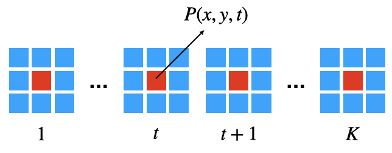
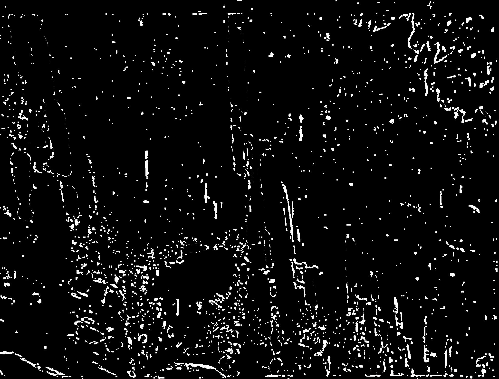
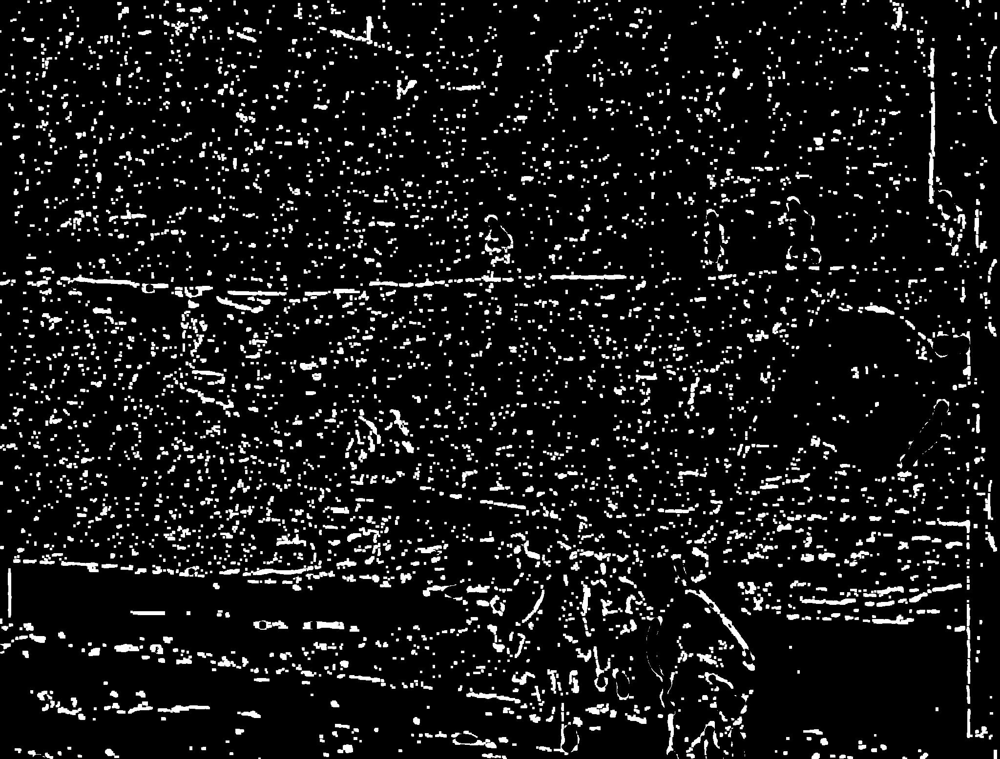

# RSCH_defect-detection_HMM
## Features of defects
- Regular scratches
  - relatively in fixed location of the whole film
  - relatively the same shape if appears in the same location
  - big size, greater than 10 pixels and less than 50 pixels
  - caused by stress, e.g. it was pressed by some big things or was bent
- Random defects
  - randomly appears in any location of the film
  - small size, within 10 pixels like noise
  - cuased by the friction of small dirts between 2 films

## Model

Hidden Markov Model

- Hidden states:
  - "Background 1"
  - "Transition from background to foreground"
  - "Foreground"
  - "Transition from foreground to background"
  - "Background 2"
- Observasion space, discrete value from 0 to 255:
  - The absolute difference of 2 neighbor frames (t derivative)
  - The absolute difference of 2 neighbor rows (y derivative)
  - The absolute difference of 2 neighbor columns (x derivative)

## Train

Step 1, extract 3 kinds of features

- Compute the absolute difference of 2 neighbor frames
- Compute the absolute difference of 2 neighbor rows 
- Compute the absolute difference of 2 neighbor columns

Step 2, group frames by 13

- 12 frames ahead of the target frame and 12 frames after the target frame

Step 3, train 3 HMMs using Forward-Backward algorithm

## Detect

Step 1, extract 3 kinds of features

Step 2, group frames by 13

Step 3, calculate likelihood of rest image sequences

- Remove each frame in the image sequences, e.g., remove the 2nd frame of the total 13 frames
- Calculate the likelihood of the rest 12 frames. Ensemble 3 kinds of features
- Normalize the 12 likelihoods. If the likelihood of the center frame is greater than a given threshold, then the center pixel is marked as defects

Step 4, using median filter to mitigate the false alarm

- Moving objects and defects have something in common in the temporal domain, for example they all last in the same location for a very short period of time, but they have difference in spaticial domain. 
- The most noticeable difference between moving objects and defects are that moving objects are larger than the defects. Moreover, moving objects are somehow continues in the temporal domain while defects are random
- Therefore, we use median filter to filter out the small prospective defects and the remaining defects are actually the moving objects.

## Samples

### Sample 1

Before and after

Detection results

### Sample 2

Before and after

## Weakness
Still cannot detect some defects whose features are more like the watermark. For example, the top-left of the first sample.

## Other failed approaches
### pattern match
- manually design defects features, like a bar, hole, regular or irregular, etc
- scale them and match the target film

Failed because it can match many useful small objects, like bullet, leaves, and small decorations.

### edge detection and filter
The intuition is that the defects are usually white and has a very sharp edge on the film.

Failed because of the same reason as the pattern match

### temporal pattern match 
Tried to use information of sequential frames but also failed because it's hard to design such temporal pattern

### statics model
Intuition: the intensity of a pixel can be estimated by the neighbor (temporal and spacial) pixels. If the estimated intensity has a huge gap of the real intensity, we say it is a defect.

Failed because of the trivial distribution. The estimation is more like the average of the neighbor pixels.

## Rethinking
### supervised learning
- Manually design the degradation: regular scratches and random defects.
- Classify each pixel as defect or not defect

### unsupervised learning
- Randomly mask out some pixels and train a model to predict them
- If the estimated intensity has a huge gap of the real intensity, we say it is a defect.

It is the same as the failed statics model, but by using a big model rather than Gaussain I hope it can learn a more precise distribution.
